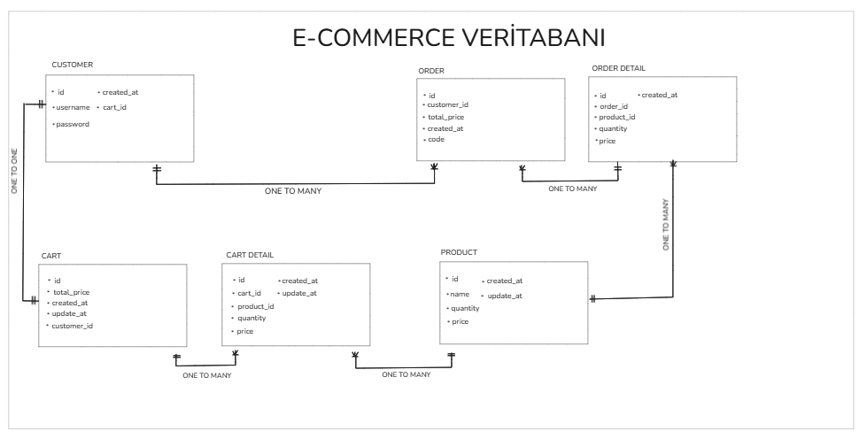

## Spring Boot ile yazılmış bir e-ticaret uygulaması.

### Genel olarak e-ticaret uygulamalarında görülen müşteri oluşturma, sepete ürün ekleme/çıkarma, sipariş oluşturma gibi temel işlemleri içerir. 

### Restful API olarak yazılmamıştır. İlgili servisler main method içerisinde çağrılmıştır.

### Proje Detayları:
- Veritabanı: PostgreSQL
- ORM: Hibernate
- Java Versiyonu: 23
- Tipi: Maven
- Spring Boot Versiyonu: 3.4.0

### Servisler:
- CustomerService: Müşteri ile ilgili işlemleri yapar.
  - AddCustomer: Müşteri ekleme işlemi.

- ProductService: Ürün ile ilgili işlemleri yapar.
  - GetProduct: Ürün listeleme işlemi.
  - AddProduct: Ürün ekleme işlemi.
  - UpdateProduct: Ürün güncelleme işlemi.
  - DeleteProduct: Ürün silme işlemi.
  

- CartService: Sepet ile ilgili işlemleri yapar.
  - GetCart: Sepet listeleme işlemi.
  - AddProductToCart: Sepete ürün ekleme işlemi.
  - UpdateCart: Sepet güncelleme işlemi.
  - RemoveProductFromCart: Sepetten ürün çıkarma işlemi.
  - EmptyCart: Sepeti boşaltma işlemi.

- OrderService: Sipariş ile ilgili işlemleri yapar.
  - PlaceOrder(Checkout): Cart'taki ürünleri siparişe dönüştürme işlemi.
  - GetOrderForCode: Sipariş koduna göre sipariş bilgilerini getirme işlemi.
  - GetAllOrdersForCustomer: Müşteriye ait tüm siparişleri listeleme işlemi.

### Tablolar:
- customer: Müşteri bilgilerini tutar.
- product: Ürün bilgilerini tutar.
- cart: Sepetin genel bilgilerini tutar.
- cart_detail: Sepetin detay bilgilerini tutar.
  - Sepet içerisindeki ürünlerin tutulduğu tablodur.
- order: Siparişin genel bilgilerini tutar.
- order_detail: Siparişin detay bilgilerini tutar.
  - sipariş içerisindeki ürünlerin tutulduğu tablodur.

### Veritabanı Tablo İlişkileri:

### Akış (Flow):
#### Program başlatıldığında,
    1. Bir müşteri sisteme eklenir.
    2. Ürünler sisteme eklenir.
    3. AddProductToCart servisi ile müşterinin sepetine ürünler eklenir.
    4. Eklenen ürünlerin miktarı UpdateCart servisi ile güncellenir.
    5. Ürünlerden birinin RemoveProductFromCart servisi ile sepetten çıkarılması sağlanır.
    6. PlaceOrder servisi ile sepetin içindeki ürünler bir siparişe dönüştürülür.
    7. GetOrderForCode servisi ile sipariş koduna göre sipariş takibi yapılır.

### Genel Bilgiler:
- Sepet: Müşterinin sitede beğendiği ürünleri topladığı yerdir.
- Sipariş: Müşterinin sepetindeki ürünleri satın almasıdır.
- Uygulamada her müşterinin bir sepeti vardır ve aktif olarak her zaman aynı sepeti günceller.
- Ancak bir müşterinin birden fazla siparişi olabilir.
- Sipariş verildikten sonra sepet boşaltılır.
- Ürünler üzerinde stok takibi yapılır. Stokta kalmayan ürünler sepete eklenemez.

